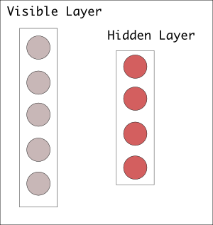
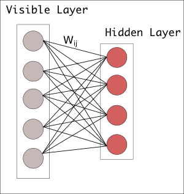

# Restricted Boltzmann Machines

RBMs are generative models which constitute the building blocks of Deep Belief Networks. They are basically bipartite graphs of neurons : two fully connected layers of neurons with no interconnections within a layer. One is a visible layer and the other is hidden. An unrestricted bolztmann machine allows connections between hidden layer units. This restriction in RBM helps in training[[2](http://www.cs.toronto.edu/~fritz/absps/cdmiguel.pdf)] it efficiently.

Deep Belief Networks can be formed by stacking RBMs and fine tuning the resulting deep network by using gradient descent and backpropagation.

Consider a training set of binary vectors representing images. The pixels correspond to visible units and the feature detectors correspond to hidden units. The joint configuration, (v,h) has an energy,

$E(v_{i},h_{j}) = -\sum_{i} a_{i}v_{i} - \sum_{j} b_{j}h{j} - \sum_{i}\sum_{j} v_{i}w_{i,j}h_{j}$

where  
$v_{i}$ : ith unit of visible layer 
$h_{j}$ : jth unit of hidden  layer 
$w_{i,j}$ : (i,j)th unit of weight matrix connecting v and h 
a : visible layer bias 
b : hidden  layer bias 

In Matrix notation,  

$E(v,h) = -a^Tv -b^Th - v^TWh$  

## Forward Pass

In the forward pass, the binary input vectors get multiplied by weights $W_{ij}$ with a bias of b0. The result is squashed between 0 and 1, by a squashing function, typically sigmoid. The forward pass just acts as an autoencoder. 

Activation, $a = x.W + b_{0}$

In the forward pass, the probability of output given a weighted input, $p(a|x;W)$ is estimated.

## Backward Pass for Reconstruction

In the backward pass, the activation a is propagated backwards by multiplying with corresponding weights $W_{ij}$. This value is summed up with the visible layer bias $b1$, to approximately provide a reconstruction of the original input. 

Reconstructed input, $r = b_{1} + Wa$  

The difference between the original input vector x and the reconstruction r, is the error. This error is backpropagated in order to adjust the weights to minimize the error. Here, the probability distribution of input given a weighted output(activation) is estimated.

Jointly, forward and backward passed estimate a joint probability distribution $p(x,a)$.

## KL-divergence

To estimate the difference between the original distribution and the reconstructed distribution, KL-divergence is used, which basically measures the non-overlapping (divergent) areas of two probability distribution curves. An optimization algorithm minimizes this non-overlapping area by adjusting the weights. As the network approximates the original distribution, the weights slowly resemble an encoded form of the input distribution.

## Probabilistic View

The probability distribution over all possible combinations of (v,h) using the energy function is given by,

$p(v,h) = \frac{1}{Z}e^{-E(v,h)}$  

where $Z = \sum_{v,h} e^{-E(v,h)}$

$p(v) = \frac{1}{Z} \sum_{h} e^{-E(v,h)}$

From the above equation, we observe that the probability assigned to training image can be increased by adjusting the weights in order to reduce the energy of the configuration. Also by increasing the energy of the other training images to increase the value of partition function, Z.

## Energy Based Models

Each configuration of nodes produce a particular value of energy(scalar). Learning the right configuration means minimizing the energy. Probability distribution of any energy based model is given by  

$p(x) = \frac{e^{-E(x)}}{Z}$

where the normalizing factor Z is called the partition function, is the summation of energy of all possible configuration of the model.

$Z = \sum_x e^{-E(x)}$  

Learning of energy models can be achieved by minimizing the negative log likelihood.

Likelihood, $L(D,\theta) = \frac{1}{N} \sum_{x(i) \epsilon D} log(p(x^{(i)}))$  
Loss, $l(D,\theta) = - L(D,\theta)$  

where  
$\theta$ : paramters of model  
D : input dataset  
$x(i)$ : an example in D  

## Energy Based Models with Hidden units

Hidden units increase the expressive power of the model. 

$P(x) = \sum_{h} P(x,h) = \sum_{h} \frac{e^{-E(x,h)}}{Z}$

Free Energy, $F(x) = -log( \sum_{h} e^{-E(x,h)} )$

Now $P(x) = \frac{e^{-F(x)}}{Z}$

## Notes

1. **Symmetric** : Because inputs from all visible nodes are being passed to all hidden nodes, an RBM can be defined as a symmetrical bipartite graph.
2. **Generative Learning** : Reconstruction is making guesses about the probability distribution of the original input; i.e. the values of many varied points at once. This is known as generative learning, which must be distinguished from the so-called discriminative learning performed by classification, which maps inputs to labels, effectively drawing lines between groups of data points.
3. **Joint Probability** : the simultaneous probability of x given a and of a given x, expressed as the shared weights between the two layers of the RBM. 

## References

1. [Wikipedia](http://www.wikiwand.com/en/Restricted_Boltzmann_machine)
2. [On Contrastive Divergence](http://www.cs.toronto.edu/~fritz/absps/cdmiguel.pdf)
